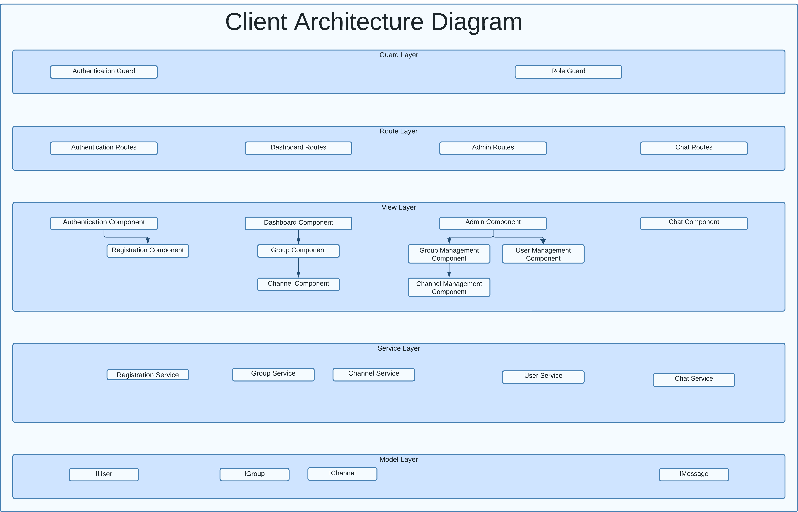
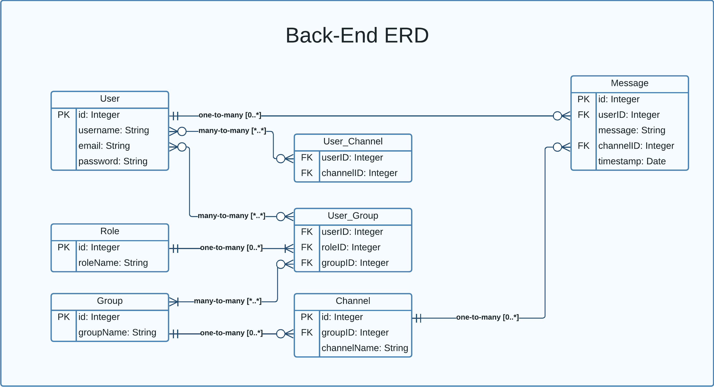

## Table of Contents

- [Chat Application Project](#chat-application-project)
  - [Setup Environment](#setup-environment)
    - [Clone the repository](#clone-the-repository)
    - [Navigate to the project directory](#navigate-to-the-project-directory)
    - [Install dependencies](#install-dependencies)
    - [Run the application](#run-the-application)
    - [Super Admin Credentials](#super-admin-credentials)
  - [Brief Description](#brief-description)
  - [Version Control System Description](#version-control-system-description)
    - [Commit Strategy](#commit-strategy)
    - [Branching](#branching)
    - [Automation](#automation)
    - [Documentation](#documentation)
    - [Quality Assurance](#quality-assurance)
  - [Client-Server Interaction](#client-server-interaction)
    - [REST APIs](#rest-apis)
    - [Angular Component Updates](#angular-component-updates)
  - [Implementation Checklist Stage 2](#implementation-checklist-stage-2)
  - [Application Overview](#application-overview)
  - [User Roles \& Permissions](#user-roles--permissions)
  - [Specific Requirements](#specific-requirements)
    - [Group](#group)
    - [Channel](#channel)
    - [Users](#users)
  - [Project Definition](#project-definition)
  - [Angular Client-Side Implementation Checklist](#angular-client-side-implementation-checklist)
    - [Components](#components)
    - [Interfaces](#interfaces)
    - [Routes](#routes)
    - [Guards](#guards)
    - [Services](#services)
  - [Client Architecture Diagram](#client-architecture-diagram)
  - [Server Implementation](#server-implementation)
  - [Entity Relationship Diagram](#entity-relationship-diagram)
    - [Server Routes](#server-routes)
  - [Helper Functions](#helper-functions)
    - [createUser(username, email, password)](#createuserusername-email-password)
    - [Server Implementation Checklist](#server-implementation-checklist)

# Chat Application Project

## Setup Environment

### Clone the repository

`https://github.com/hector-moya/my-chat-app.git`

### Navigate to the project directory

`cd my-chat-app`

### Install dependencies

`npm run install`

### Run the application

`npm run start`

### Super Admin Credentials
- **email**: super@admin.com
- **password**: 123
- 
## Brief Description

The chat application aims to build a text/video chat system using the MEAN stack (MongoDB, Express, Angular, Node) along with sockets.io and Peer.js. The chat system will allow users to communicate in real time within different groups and channels. There are three levels of permissions: Super Admin, Group Admin, and User.

## Version Control System Description

The project follows best practices in version control using Git and is hosted on a GitHub repository. The repository is structured with a root folder that contains two main sub-folders: one for the server and one for the client. This separation ensures that the project remains organized as it scales.

### Commit Strategy

1. **Frequent Commits**: Commits are made approximately every hour during active development.
2. **Milestone Commits**: Each commit corresponds to a functional milestone, ensuring that the repository always contains working code.
3. **Informative Commit Messages**: Every commit has a meaningful message that indicates the changes or features introduced.

### Branching

A single `main` branch has been sufficient for the current needs. However, the project is structured in a way that would allow for feature branching and pull if needed.

### Automation

A custom script is utilized to automate the Git operations (`git add .`, `git commit`, and `git push`). This script runs only when a functional milestone is achieved, ensuring the integrity of the codebase.

### Documentation

A comprehensive README file documents the project setup, features, and implementation checklists. This README file is updated regularly to reflect the current state of the project.

### Quality Assurance

To further ensure the quality of the code, no broken code is committed. Each commit represents a stable build.

## Client-Server Interaction

The client and server in this chat application communicate using REST APIs and WebSockets for real-time updates. Below are the details of how data changes on the server-side impact the Angular components on the client-side.

### REST APIs

The server exposes several REST endpoints for handling operations related to authentication, users, groups, and channels.

1. **Authentication**: 
    - When a user logs in or registers through the Authentication Component, a POST request is made to the server's `/api/auth/login` or `/api/auth/register` endpoints.
    - The server verifies the data and returns a user object, which updates the client-side state and redirects the user to the Dashboard Component.

2. **User Management**:
    - CRUD operations for users are handled through the `/api/user` endpoint.
    - Any changes here are reflected in real-time on the User Management Component for the Super Admin.

3. **Group and Channel Management**:
    - CRUD operations for groups and channels are handled through `/api/group` and `/api/channel` endpoints.
    - The Group and Channel Components update in real-time when data is added, modified, or deleted.

### Angular Component Updates

1. **Dashboard Component**: 
    - Displays a summary of user activities and is updated whenever there is a change in groups or channels that the user is part of.

2. **Group Component**: 
    - Lists all the groups a user is part of and updates in real-time when a new group is created or an existing one is modified.

3. **Channel Component**: 
    - Lists all channels within a selected group and updates in real-time when a new channel is added or an existing one is modified.

## Implementation Checklist Stage 2

| Feature/Component           | Implemented | Notes                                                                                                    |
| --------------------------- | ----------- | -------------------------------------------------------------------------------------------------------- |
| Planning                    | [x]         | Layer component diagram, Class Diagram for Services and ER diagram created.                              |
| Documentation               | [x]         | Documenting all methods, next step is to document variables                                              |
| User Interface              | [x]         | Basic user interface applied using TailwindCSS for all components, needs improvement in next iterations. |
| Data Storage                | [x]         | Browser local storage used, and dummy data stored in json                                                |
| User Login                  | [x]         | User login and register new user fully implemented with guard gates                                      |
| Assign Users                | [!]         | User assignment still needs implementation, super admin can create new users from the dashboard          |
| Implement MongoDB           | [x]         | Replace Local storage JSON with MongoDB database                                                         |
| Implement Socket            | [!]         | Implement socket.io for real-time chat                                                                   |
| Implement Peer              | [!]         | Implement Peer.js for video chat                                                                         |
| Implement Unit Tests        | [ ]         | Implement unit tests for all components, services and routes.                                            |
| Implement Integration Tests | [ ]         | Implement integration tests for all the system.                                                          |

## Application Overview

- **Stack**: MEAN (MongoDB, Express, Angular, Node)
- **Additional Libraries**: Socket.io, Peer.js
- **Layers**: Guard, Route, View, Service, Model
- **User Roles**: Super Admin, Group Admin, User

## User Roles & Permissions

- **Super Admin**: Full access, can promote/demote users, manage all groups and channels.
- **Group Admin**: Limited to groups they manage, can create/delete groups and channels within them.
- **User**: Can join groups and channels they have access to, and can chat within those channels.

## Specific Requirements

### Group

- Open to users with permission from a Group Admin or Super Admin.
- Multiple groups and multiple admins per group are allowed.
- Users can be part of multiple groups.
- Group Admin can manage multiple groups but only ones they created.
- Super Admin has fallback access to all groups.

### Channel

- Sub-section of a group for the purpose of chatting.
- Users can choose any channel within a group they belong to.

### Users

- Identified by a unique username.
- Model includes: username, email, id, roles[], groups[].

## Project Definition

## Angular Client-Side Implementation Checklist

This checklist aims to guide you through the Angular implementation of the client-side part of the chat application.

### Components

`ng g c <component-name> --inline-style --inline-template --skipTests`

| Component                    | Implemented | Notes                                                                         |
| ---------------------------- | ----------- | ----------------------------------------------------------------------------- |
| Authentication Component     | [X]         | Parent for Login and Registration                                             |
| Login Component              | [X]         | Child of Authentication component. Handles user login                         |
| Registration Component       | [X]         | Child of Authentication component. Handles user registration                  |
| Dashboard Component          | [X]         | Parent component post-login                                                   |
| Group Component              | [!]         | Child of Dashboard component. Displays groups and allows for group management |
| Channel Component            | [!]         | Child of Group component. Displays channels and allows for channel management |
| Channel Management Component | [ ]         | Child of Channel component. Allows for user channel management                |
| Chat Component               | [ ]         | Manages real-time chat                                                        |
| User Management Component    | [X]         | Child of Admin component. Manages users                                       |
| Modal Component              | [X]         | Global component. Reusable modal to display management features               |

### Interfaces

`ng g interface <interface-name> --skipTests --type=model --project=client`

| Interface | Implemented | Notes                     |
| --------- | ----------- | ------------------------- |
| IUser     | [X]         | Defines the user model    |
| IGroup    | [X]         | Defines the group model   |
| IChannel  | [x]         | Defines the channel model |
| IMessage  | [ ]         | Defines the message model |

### Routes

| Route                | Implemented | Notes                                        |
| -------------------- | ----------- | -------------------------------------------- |
| Authentication Route | [X]         | For Login and Registration                   |
| Dashboard Route      | [X]         | For Dashboard, Group, and Channel components |
| Chat Route           | [ ]         | For the Chat component                       |

### Guards

`ng g guard <guard-name> --skipTests --project=client`

| Guard                | Implemented | Notes                          |
| -------------------- | ----------- | ------------------------------ |
| Authentication Guard | [X]         | Check if user is authenticated |
| Role Guard           | [ ]         | Check the user role            |

### Services

`ng g service <service-name> --skipTests --project=client`

| Service                 | Implemented | Notes                      |
| ----------------------- | ----------- | -------------------------- |
| Authentication Service  | [X]         | Manages authentication     |
| Group Service           | [X]         | Manages group operations   |
| Channel Service         | [X]         | Manages channel operations |
| Chat Service            | [ ]         | Manages real-time chat     |
| User Management Service | [X]         | Manages user model         |
| Notification Service    | [X]         | Manages notifications      |

## Client Architecture Diagram



## Server Implementation

## Entity Relationship Diagram


### Server Routes

- **api/auth**: Authentication route for login and registration.
  - `POST /login`: User login.
  - `POST /register`: User registration.
  
- **api/user**: Route for managing user data and CRUD operations.
  - `GET /`: Retrieve all users.
  - `GET /:id`: Retrieve user by ID.
  - `POST /`: Create a new user.
  - `PUT /:id`: Update an existing user.
  - `DELETE /:id`: Delete a user by ID.
  - `PUT /promote/:id`: Promote a user to super user status.
  
- **api/group**: Route for managing group data and CRUD operations.
  - `GET /`: Retrieve all groups.
  - `GET /byUser/:userId`: Retrieve all groups that a specific user belongs to.
  - `GET /userRole/:groupId/:userId`: Retrieve the role of a user in a specific group.
  - `POST /`: Add a new group.
  - `PUT /:id`: Update an existing group.
  - `DELETE /:id`: Delete a group and all its references.
  - `PUT /assignAdmin/:groupId/:userId`: Assign a user as admin of a specific group.
  
- **api/channel**: Route for managing channel data and CRUD operations.
  - `GET /`: Retrieve all channels.
  - `GET /:id`: Retrieve a channel by ID.
  - `GET /byUser/:groupId/:userId`: Retrieve all channels for a user in a specific group.
  - `POST /`: Create a new channel.
  - `PUT /:id`: Update an existing channel.
  - `DELETE /:id`: Delete a channel by ID.

- **api/auth**: Route for user authentication and registration.
  - `POST /login`: Authenticate a user and return a user object if valid.
  - `POST /register`: Register a new user and return the user object.

## Helper Functions

### createUser(username, email, password)

This helper function is used for creating a new user.

- **Parameters:**
  - `username`: The username for the new user.
  - `email`: The email address for the new user.
  - `password`: The password for the new user.

- **Returns:**
  - An object containing the new user if successful.
  - An object with an `error` property if an error occurs.

- **Usage:**
  ```javascript
  const { user, error } = createUser('johnDoe', 'john@example.com', 'password123');


### Server Implementation Checklist

| Entity/Route             | Implemented | Notes                                                                        |
| ------------------------ | ----------- | ---------------------------------------------------------------------------- |
| Database                 | [X]         | MongoDB database hosted on MongoDB                                           |
| Mongoose Models          | [X]         |                                                                              |
| User Model               | [X]         |                                                                              |
| Group Model              | [X]         |                                                                              |
| Channel Model            | [X]         |                                                                              |
| Message Model            | [X]         |                                                                              |
| Role Model               | [X]         |                                                                              |
| User-Group Association   | [X]         |                                                                              |
| User-Channel Association | [X]         |                                                                              |
| api/auth Routes          | [X]         | For handling user authentication and registration                            |
| api/user Routes          | [X]         | CRUD operations for User entity                                              |
| api/group Routes         | [X]         | CRUD operations for Group entity                                             |
| api/channel Routes       | [X]         | CRUD operations for Channel entity                                           |
| api/message Routes       | [ ]         | CRUD operations for Message entity, and for handling real-time chat messages |

