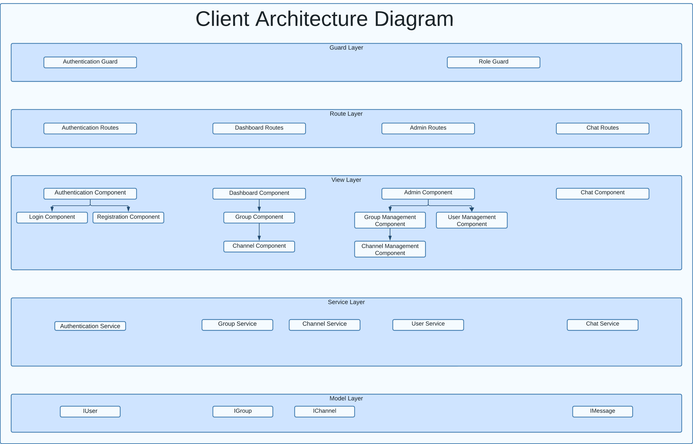

# Chat Application Project

## Table of Contents

- [Chat Application Project](#chat-application-project)
  - [Table of Contents](#table-of-contents)
  - [Brief Description](#brief-description)
  - [Implementation Checklist](#implementation-checklist)
  - [Application Overview](#application-overview)
  - [User Roles \& Permissions](#user-roles--permissions)
  - [Specific Requirements](#specific-requirements)
    - [Group](#group)
    - [Channel](#channel)
    - [Users](#users)
  - [Project Definition](#project-definition)
  - [Angular Client-Side Implementation Checklist](#angular-client-side-implementation-checklist)
    - [Components](#components)
    - [Interfaces](#interfaces)
    - [Routes](#routes)
    - [Guards](#guards)
    - [Services](#services)
  - [Client Architecture Diagram](#client-architecture-diagram)
  - [Server Implementation](#server-implementation)
    - [Server Routes](#server-routes)
    - [Server Implementation Checklist](#server-implementation-checklist)
  - [Entity Relationship Diagram](#entity-relationship-diagram)

## Brief Description

The chat application aims to build a text/video chat system using the MEAN stack (MongoDB, Express, Angular, Node) along with sockets.io and Peer.js. The chat system will allow users to communicate in real time within different groups and channels. There are three levels of permissions: Super Admin, Group Admin, and User.

## Implementation Checklist

| Feature/Component | Implemented | Notes                                                                       |
| ----------------- | ----------- | --------------------------------------------------------------------------- |
| Planning          | [x]         | Layer component diagram, Class Diagram for Services and ER diagram created. |
| Documentation     | [ ]         |                                                                             |
| User Interface    | [ ]         |                                                                             |
| Data Storage      | [ ]         |                                                                             |
| User Login        | [ ]         |                                                                             |
| Assign Users      | [ ]         |                                                                             |

## Application Overview

- **Stack**: MEAN (MongoDB, Express, Angular, Node)
- **Additional Libraries**: Socket.io, Peer.js
- **Layers**: Guard, Route, View, Service, Model
- **User Roles**: Super Admin, Group Admin, User

## User Roles & Permissions

- **Super Admin**: Full access, can promote/demote users, manage all groups and channels.
- **Group Admin**: Limited to groups they manage, can create/delete groups and channels within them.
- **User**: Can join groups and channels they have access to, and can chat within those channels.

## Specific Requirements

### Group

- Open to users with permission from a Group Admin or Super Admin.
- Multiple groups and multiple admins per group are allowed.
- Users can be part of multiple groups.
- Group Admin can manage multiple groups but only ones they created.
- Super Admin has fallback access to all groups.

### Channel

- Sub-section of a group for the purpose of chatting.
- Users can choose any channel within a group they belong to.

### Users

- Identified by a unique username.
- Model includes: username, email, id, roles[], groups[].

## Project Definition

## Angular Client-Side Implementation Checklist

This checklist aims to guide you through the Angular implementation of the client-side part of the chat application.

### Components

`ng g c <component-name> --inline-style --inline-template --skipTests`

| Component                    | Implemented | Notes                                                        |
| ---------------------------- | ----------- | ------------------------------------------------------------ |
| Authentication Component     | [X]         | Parent for Login and Registration                            |
| Login Component              | [X]         | Child of Authentication component. Handles user login        |
| Registration Component       | [X]         | Child of Authentication component. Handles user registration |
| Dashboard Component          | [ ]         | Parent component post-login                                  |
| Group Component              | [ ]         | Child of Dashboard component. Displays user groups           |
| Channel Component            | [ ]         | Child of Group component. Displays channels within a group   |
| Chat Component               | [ ]         | Manages real-time chat                                       |
| Admin Component              | [ ]         | Parent for all admin functionalities                         |
| User Management Component    | [ ]         | Child of Admin component. Manages users                      |
| Group Management Component   | [ ]         | Child of Admin component. Manages groups                     |
| Channel Management Component | [ ]         | Child of Admin component. Manages channels                   |

### Interfaces

`ng g interface <interface-name> --skipTests --type=model --project=client`

| Interface | Implemented | Notes                     |
| --------- | ----------- | ------------------------- |
| IUser     | [X]         | Defines the user model    |
| IGroup    | [ ]         | Defines the group model   |
| IChannel  | [ ]         | Defines the channel model |
| IMessage  | [ ]         | Defines the message model |

### Routes

| Route                | Implemented | Notes                                        |
| -------------------- | ----------- | -------------------------------------------- |
| Authentication Route | [X]         | For Login and Registration                   |
| Dashboard Route      | [ ]         | For Dashboard, Group, and Channel components |
| Chat Route           | [ ]         | For the Chat component                       |
| Admin Route          | [ ]         | For all admin functionalities                |

### Guards

`ng g guard <guard-name> --skipTests --project=client`

| Guard                | Implemented | Notes                          |
| -------------------- | ----------- | ------------------------------ |
| Authentication Guard | [ ]         | Check if user is authenticated |
| Role Guard           | [ ]         | Check the user role            |

### Services

`ng g service <service-name> --skipTests --project=client`

| Service                 | Implemented | Notes                      |
| ----------------------- | ----------- | -------------------------- |
| Authentication Service  | [X]         | Manages authentication     |
| Group Service           | [ ]         | Manages group operations   |
| Channel Service         | [ ]         | Manages channel operations |
| Chat Service            | [ ]         | Manages real-time chat     |
| User Management Service | [ ]         | Manages user model         |

## Client Architecture Diagram

## Server Implementation

### Server Routes

- **api/auth**: Authentication route for login and registration.
  - `POST /login`: User login.
  - `POST /register`: User registration.
- **api/user**: Route for managing user data and CRUD operations.
  - `GET /:id`: Retrieve user by ID.
  - ...
- **api/group**: Route for managing groups.
  - `GET /`: Retrieve all groups.
  - ...
- **api/channel**: Route for managing channels within groups.
  - `GET /:groupId`: Retrieve all channels within a group.
  - ...
- **api/message**: Route for handling real-time chat messages.
  - `GET /:channelId`: Retrieve all messages within a channel.
  - ...

### Server Implementation Checklist

| Entity/Route             | Implemented | Notes                                                                        |
| ------------------------ | ----------- | ---------------------------------------------------------------------------- |
| User Entity              | [X]         |                                                                              |
| Group Entity             | [X]         |                                                                              |
| Channel Entity           | [X]         |                                                                              |
| Message Entity           | [X]         |                                                                              |
| Role Entity              | [X]         |                                                                              |
| User-Group Association   | [X]         |                                                                              |
| User-Channel Association | [X]         |                                                                              |
| api/auth Routes          | [X]         | For handling user authentication  and registration                           |
| api/user Routes          | [X]         | CRUD operations for User entity                                              |
| api/group Routes         | [ ]         | CRUD operations for Group entity                                             |
| api/channel Routes       | [ ]         | CRUD operations for Channel entity                                           |
| api/message Routes       | [ ]         | CRUD operations for Message entity, and for handling real-time chat messages |

## Entity Relationship Diagram

